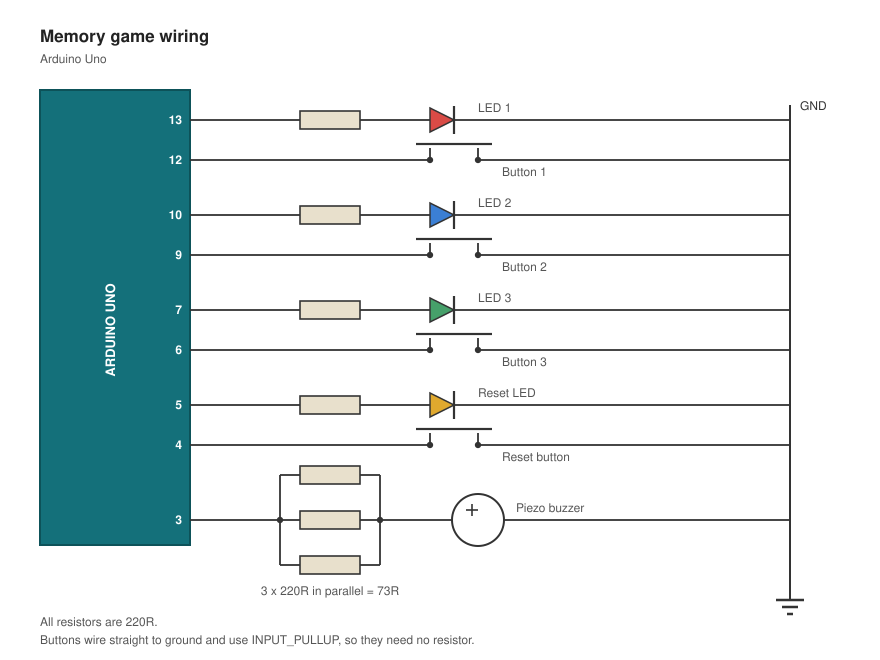

# Memory Game

A memory game in the style of Simon built on an Arduino Uno with a web leaderboard that
records every run. Three LEDs play a sequence of flashes according to a growing
pattern which the player has to repeat with three buttons. Upon entering an
incorrect sequence, the result goes through USB serial to a local Node server
and appears on a live leaderboard within the browser.

Firmware is C++, the serial bridge is Python (pyserial and requests), and the
server and UI are JavaScript with no external dependencies.

## Demo

https://github.com/user-attachments/assets/e55d4d43-c792-4e7c-8879-a64304ea9f18


## Hardware



| Pin | Component | Detail |
|-----|-----------|--------|
| D13 | Lane 1 LED | 523 Hz (C), 220 Ω in series |
| D12 | Lane 1 button | INPUT_PULLUP, wired to GND |
| D10 | Lane 2 LED | 587 Hz (D), 220 Ω in series |
| D9  | Lane 2 button | INPUT_PULLUP, wired to GND |
| D7  | Lane 3 LED | 659 Hz (E), 220 Ω in series |
| D6  | Lane 3 button | INPUT_PULLUP, wired to GND |
| D5  | Reset LED | 220 Ω in series |
| D4  | Reset button | INPUT_PULLUP, wired to GND |
| D3  | Piezo buzzer | 3 x 220 Ω in parallel (~73 Ω) in series |
| A0  | Not connected | Left floating; noise seeds random() |

## Notes

**Scores disappeared if the server was down.** It now uses a 5-second timeout
and puts undelivered results in a queue, flushing them on the next
successful post. It also reconnects on its own when the board is unplugged.

## Running it

Requires Node and Python 3.

```bash
pip3 install pyserial requests
```

Upload `memory_game.ino` to the board with the Arduino IDE.

```bash
./start.command
```

You may need to allow the file to be run through Settings > Privacy & Security.
It will start the server, open the leaderboard, and launch the serial
listener.

If you want to forego allowing the running script, run these separately:

```bash
node server.js       # leaderboard at http://localhost:3000
python3 listener.py  # serial bridge
```

The listener will find the board's port automatically.

## Playing

1. On power-up, press button 1, 2, or 3 to pick your player number. That LED
   blinks twice, then a tone means "get ready".
2. Watch the pattern, then repeat it.
3. Each round replays the same pattern with one new step appended.
4. A wrong press ends the game and posts your score.
5. The reset button restarts from player selection at any time.

**Score = rounds survived.** Losing on the first pattern scores 0.

## Project structure

| File | Purpose |
|------|---------|
| `memory_game.ino` | Firmware: input, LEDs, audio, game logic, serial output |
| `listener.py` | Serial to HTTP bridge, with reconnect and a retry queue |
| `server.js` | Leaderboard server, Node standard library only |
| `public/index.html` | The leaderboard page, CSS and JS inline |
| `scores.json` | Flat-file database. Delete it to reset the leaderboard |
| `start.command` | macOS launcher for all of the above |

## License

MIT. See [LICENSE](LICENSE).
